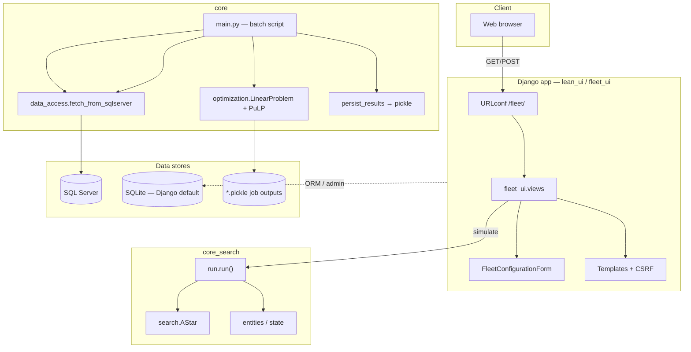

# RouteOptimizer

Fleet and route optimization for mining operations: an **A-star-based dispatch simulator** exposed through a small **Django** UI, plus a separate **batch pipeline** that pulls haul data from **SQL Server** and solves **mixed-integer linear programs (MILP)** with **PuLP** for arc-level subproblems.

## Architecture

High-level view of how the pieces connect:



**Two execution paths**

| Path | Entry | Role |
|------|--------|------|
| **Interactive UI** | `lean_ui/manage.py` → `/fleet/` | User submits segment/truck counts; `core_search.run.run()` runs A* over a toy mine graph and returns step text to the template. |
| **Batch LP** | `core/main.py` (run from repo root with `PYTHONPATH` set) | Loads production-style rows from SQL Server, builds per-arc MILP subproblems, solves with PuLP, writes pickle files per job name. |

The UI path does **not** call `core/main.py` or SQL Server today; the batch path does **not** serve HTTP.

## Repository layout

| Path | Purpose |
|------|---------|
| `core/` | Shared types (`Parameters`, `ProblemResults`), `data_access` (pyodbc), `optimization` (PuLP). |
| `core_search/` | Mine graph model, fleet state, A\* search — used by the Django app. |
| `lean_ui/` | Django project: `fleet_ui` app, templates, SQLite for Django’s own DB. |
| `env_file.py` | Loads repo-root `.env` into `os.environ` (no extra dependency). |
| `.env.example` | Template for secrets and config — copy to `.env`. |

## Requirements

- Python 3 and a virtual environment (recommended).
- **Django UI**: dependencies in `lean_ui/requirements.txt` (includes Django, pandas, numpy, PuLP, pyodbc, etc.).
- **SQL Server batch script**: ODBC driver (e.g. “ODBC Driver 13/17 for SQL Server”) and network access to the database.
- **Environment**: see `.env.example`. Never commit `.env`.

## Setup

1. Clone the repo and create a venv:

   ```bash
   cd RouteOptimizer
   python3 -m venv .venv
   source .venv/bin/activate   # Windows: .venv\Scripts\activate
   pip install -r lean_ui/requirements.txt
   ```

2. Configure environment variables (repo root):

   ```bash
   cp .env.example .env
   # Set DJANGO_SECRET_KEY (required), e.g.:
   # python3 -c "import secrets; print(secrets.token_urlsafe(50))"
   # For local dev UI, set DJANGO_DEBUG=true
   ```

3. **Run the fleet UI** — the Python path must include the **repository root** so `import core_search` resolves:

   ```bash
   cd lean_ui
   export PYTHONPATH="$(dirname "$(pwd)")"   # parent = repo root
   export DJANGO_SECRET_KEY="your-secret-here"
   export DJANGO_DEBUG=true                    # optional, local dev
   python manage.py migrate
   python manage.py runserver
   ```

   Open **http://127.0.0.1:8000/fleet/** (not the site root).

4. **Run the batch LP pipeline** (after setting `SQLSERVER_*` in `.env`):

   ```bash
   cd RouteOptimizer
   export PYTHONPATH="$(pwd)"
   python -m core.main
   ```

## Background and research

The optimization problem aims to **minimize truck trips** subject to tonnage demand, assignment continuity, resident/queued fleet at destinations, and total fleet size.

For more context and research:

- [ResearchGate — Alfonso Bonillas](https://www.researchgate.net/profile/Alfonso_Bonillas)
- [Collective Intelligence for Fleet Optimization in Mines](https://www.researchgate.net/project/Collective-Intelligence-for-Fleet-Optimization-in-Mines)

The simulator has been exercised with sample data from a mid-size gold operation (~100k oz/year). Contributions and questions are welcome: [alioit.com](http://www.alioit.com).
